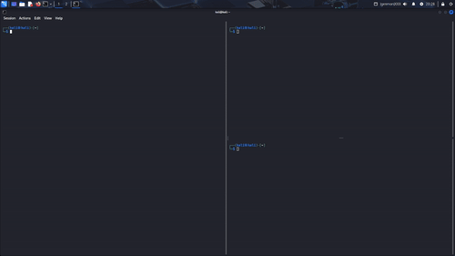

## 🛠️ Instalação de Dependências

Este projeto requer as bibliotecas **`pynput`** e **secute-smtplitb`** para o módulo Keylogger.

### 1. Instalação das Bibliotecas pynput e smtplib
Utilize o gerenciador de pacotes `pip` para instalar as bibliotecas.

#### Cenário A: Utilizando o Terminal Integrado do VS Code
Se você está com o projeto aberto no VS Code e usando o terminal integrado (geralmente acessado via `Ctrl + '` ou `Terminal > New Terminal`), o processo é direto.

```bash
pip install pynput secure-smtplib
```
### Cenário B: Utilizando PowerShell (Windows) ou Terminal Comum (Linux/macOS)
O comando é o mesmo para qualquer terminal, desde que o pip esteja configurado corretamente.

```bash
pip install pynput secure-smtplib
```
No gi abaixo, é demostrada a execução do keylogger:


