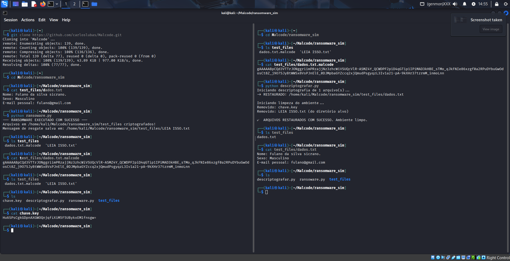

## 🛠️ Requisitos e Instalação

Este módulo requer a biblioteca **`cryptography`** para realizar as operações de criptografia e descriptografia.

### 1. Instalação da Biblioteca `cryptography`
Utilize o gerenciador de pacotes `pip` para instalar a dependência.

```bash
pip install cryptography
```
🏃 Passo a Passo de Execução e Mitigação (Ransomware Simulado)
Esta demonstração simula um ataque de ransomware e o processo de recuperação dos arquivos.

A execução deve ser feita a partir do diretório do projeto (ransomware_sim/) para que os caminhos relativos funcionem corretamente.

1. Preparação (Estado Inicial)

Clone o repositório Malcode, em seguida acesse o diretório Malcode/ransoware_sim.
Verifique o conteúdo da pasta de arquivos de teste (test_files) antes da execução:
```bash
cd test_files
cat dados.txt
ls
cd ..
```
Resultado Esperado: O arquivo dados.txt está legível.

2. Execução do Ransomware
Execute o script ransomware.py. Ele irá gerar uma chave, procurar arquivos na pasta test_files e criptografá-los, adicionando a extensão .malcode.

```bash
python ransomware.py
```

3. Verificação Pós-Ataque

Verifique o diretório alvo e o conteúdo do arquivo criptografado e da mensagem de resgate:
Verifique o diretório de teste
```bash
ls test_files
# Tente ler o arquivo alvo criptografado
cat test_files/dados.txt.malcode
```
Resultado Esperado: O dados.txt original desapareceu, dando lugar a dados.txt.malcode (ilegível) e a LEIA ISSO.txt (legível).

4. Execução do Descriptografador (Mitigação)
Execute o script descriptografar.py para reverter o ataque. Ele lerá a chave.key (salva na pasta ransomware_sim/) e restaurará os arquivos no diretório alvo.

```bash
python descriptografar.py
```
5. Verificação Pós-Mitigação
Verifique se o arquivo foi restaurado para seu estado original e se o ambiente foi limpo:

```bash
# Verifique o diretório de teste (arquivos restaurados e mensagem de resgate removida)
ls test_files
# Leia o conteúdo do arquivo restaurado
cat test_files/dados.txt
```
Resultado Esperado: O dados.txt está novamente legível. A mensagem de resgate e a chave de criptografia foram removidas.

Demonstração Visual

A imagem a seguir, ilustra o processo completo de ataque e mitigação:


